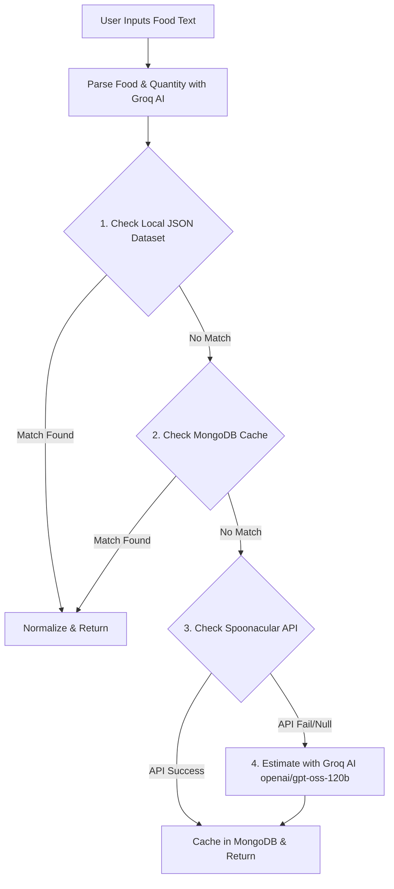

# 🥗 NutriScan — Smart Food Analyzer & Nutrition Coach

[](https://github.com/yashdarekar17/foodanaylzer/actions/workflows/main.yml)
[](https://react.dev/)
[](https://nodejs.org/)
[](https://www.mongodb.com/)
[](https://groq.com/)

**NutriScan** is a health and nutrition analysis platform. It empowers users to make informed dietary decisions through natural language food analysis, condition-aware risk scoring, automated calorie and macro logging, and a personalized AI health coach.

Whether you are tracking macros for fitness goals, managing chronic conditions (such as diabetes, high cholesterol, thyroid, reflux, or kidney disease), or just trying to eat healthier, NutriScan provides detailed insights, smart food alternatives, and direct coach feedback.

---

## 📖 Table of Contents

1. [🌟 Key Features](#-key-features)
2. [🤖 Core Architecture & AI Orchestration](#-core-architecture--ai-orchestration)
3. [💻 Technology Stack](#-technology-stack)
4. [📂 Project Structure](#-project-structure)
5. [⚙️ Getting Started & Installation](#%EF%B8%8F-getting-started--installation)
6. [🚀 CI/CD & Deployments](#-cicd--deployments)
7. [📄 License](#-license)

---

## 🌟 Key Features

*   **🔍 Natural Language Food Analysis:** Describe food items naturally (e.g., *"2 plates of paneer butter masala with 1 butter naan"*). The system parses ingredients, portion sizes, and extra items using AI to construct detailed nutrition profiles.
*   **⚠️ Condition-Aware Risk Scoring:** Provides a risk score and status (Safe, Moderate, or Risky) tailored to the user's specific health profile (e.g., checking sugar for diabetes, fats for cholesterol).
*   **💡 Smart Food Alternatives:** Recommends healthier, practical alternatives when a searched food is flagged as "Risky" or "Moderate" for the user's health condition.
*   **📊 Daily Calorie & Macro Tracker:** Tracks calories, protein, fats, and carbs. Calculates target goals using the **Mifflin-St Jeor Equation** based on weight, height, age, activity level, and target goals.
*   **💬 Interactive AI Health Coach:** 
    *   **Daily Insights:** Provides coach feedback based on daily calorie intake and goals.
    *   **NutriScan Companion:** Interactive chat assistant for diet, allergies, or goals.
*   **📋 Comprehensive User Onboarding:** A user-friendly onboarding flow to capture age, gender, weight, height (using a flexible height parser), activity level, and pre-existing health conditions.
*   **🔒 Secure User Authentication:** User signups and logins handled securely via JWT (JSON Web Tokens) and bcrypt password hashing.

---

## 🤖 Core Architecture & AI Orchestration

NutriScan features a highly robust **4-layer nutrition lookup orchestrator** to ensure fast, reliable, and cost-effective data retrieval:



1.  **Tier 1: Local Dataset (`foodData.json`)** — Fast, direct matching for common foods.
2.  **Tier 2: MongoDB Cache** — Automatically caches previous API and AI outputs for speed and optimization.
3.  **Tier 3: Spoonacular API** — Third-party lookup layer for standard ingredient database searches.
4.  **Tier 4: Groq AI Estimation** — Generates complete nutrition profiles using LLMs if all other layers miss.

---

## 💻 Technology Stack

### Frontend
*   **Library:** React.js (v19)
*   **Bundler:** Vite
*   **State Management:** Redux Toolkit (`@reduxjs/toolkit` & `react-redux`)
*   **Styling:** TailwindCSS, Vanilla CSS, Framer Motion
*   **Icons:** Lucide React & Google Material Symbols
*   **Router:** React Router DOM (v7)

### Backend
*   **Runtime:** Node.js
*   **Framework:** Express.js
*   **Database:** MongoDB via Mongoose ODM
*   **Authentication:** JWT (`jsonwebtoken`) & `bcrypt` / `bcryptjs`
*   **File Uploads:** Multer (for handling images securely)
*   **AI Integration:** Groq SDK

---

## 📂 Project Structure

The project is structured as a monorepo containing distinct frontend (`foodanalyzer`) and backend (`backend`) directories:

```
nutriscan/
├── .github/
│   └── workflows/
│       └── main.yml           # GitHub Actions CI/CD configuration
├── backend/
│   ├── data/
│   │   └── foodData.json     # Local read-only food database
│   ├── models/
│   │   ├── Food.js           # Food item schema (cached or custom added)
│   │   ├── FoodLog.js        # Individual food log entry schema
│   │   ├── MealLog.js        # Grouped meal log entry schema
│   │   └── User.js           # User schema (profile, conditions, goals)
│   ├── routes/
│   │   └── foodroutes.js     # Unified Express router containing all API routes
│   ├── services/
│   │   ├── aiService.js      # Natural language parsing & food explanations
│   │   ├── healthService.js  # Condition-aware nutrient analysis
│   │   ├── healthInsightService.js # AI coach insight generator
│   │   ├── nutritionService.js # 4-tier lookup orchestrator
│   │   └── riskCalculator.js  # Base risk score calculation engine
│   ├── uploads/              # Local storage directory for uploaded images
│   ├── index.js              # Application entry point
│   ├── jwt.js                # JWT creation and authentication middleware
│   └── package.json
└── foodanalyzer/             # React (Vite) Frontend
    ├── public/
    ├── src/
    │   ├── Store/            # Redux Store slices & actions
    │   ├── loginsignup/      # Login & Registration views
    │   ├── About.jsx         # Info page
    │   ├── Addfood.jsx       # Interface to manually add new food items
    │   ├── App.jsx           # Routing & global setup
    │   ├── Chatbox.jsx       # AI Assistant
    │   ├── Insights.jsx      # Daily calorie tracker, progress logs, & charts
    │   ├── Layoutfood.jsx    # Home dashboard page with food searching & analysis
    │   ├── Onboarding.jsx    # Onboarding questionnaires & height calculators
    │   ├── Profile.jsx       # User profile details
    │   └── main.jsx
    ├── tailwind.config.js
    ├── vite.config.js        # Vite config with Dev server API proxies
    └── package.json
```

---

## ⚙️ Getting Started & Installation

### Prerequisites
*   [Node.js](https://nodejs.org/) (v20+ recommended)
*   [MongoDB](https://www.mongodb.com/) (Local instance or MongoDB Atlas)

### Step 1: Clone the Repository
```bash
git clone https://github.com/yashdarekar17/foodanaylzer.git
cd foodanaylzer
```

### Step 2: Set Up the Backend
1. Navigate to the backend directory:
   ```bash
   cd backend
   ```
2. Install dependencies:
   ```bash
   npm install
   ```
3. Set up the required environment configuration.
4. Run database seed (optional: populates initial local food data):
   ```bash
   npm run seed
   ```
5. Start the backend server in development mode:
   ```bash
   npm run dev
   ```

### Step 3: Set Up the Frontend
1. Navigate to the frontend directory:
   ```bash
   cd ../foodanalyzer
   ```
2. Install dependencies:
   ```bash
   npm install
   ```
3. Set up the local client configuration.
4. Start the frontend development server:
   ```bash
   npm run dev
   ```

---

## 🚀 CI/CD & Deployments

This project has a pre-configured GitHub Actions CI workflow located in [.github/workflows/main.yml](file:///.github/workflows/main.yml).

Every push or pull request to the `main` branch triggers:
1.  **Frontend Pipeline:**
    *   Node environment setup.
    *   Dependency installation (`npm install`).
    *   Code quality linting (`npm run lint`).
    *   Production bundle build validation (`npm run build`).
2.  **Backend Pipeline:**
    *   Node environment setup.
    *   Dependency installation (`npm install`).

---

## 📄 License

This project is licensed under the **ISC License**. See the `package.json` for details.
